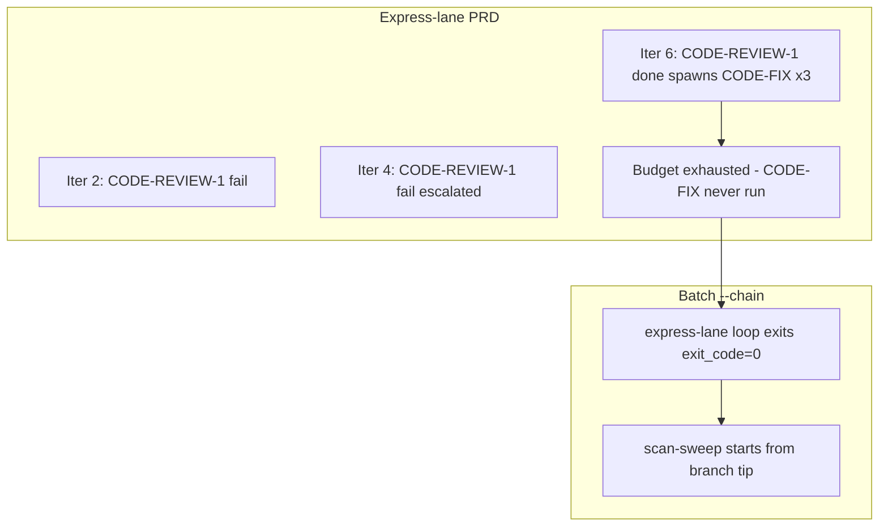

# Batch Chain Stop When PRD Incomplete

Status: **approved** — ready to implement (review 2026-06-12).

## Problem

When `task-mgr batch run --chain` runs multiple PRDs sequentially, a loop that
**exhausts its iteration budget with work remaining** still returns `exit_code = 0`.
Batch chain only stops on `exit_code != 0`, so downstream PRDs start on an
incomplete branch tip.

### Observed scenario (express-lane → scan-sweep)



This is correct **sequencing**, not a batch ordering bug. The express-lane loop
burned all 6 iterations on CODE-REVIEW-1 retries; CODE-FIX tasks were spawned on
the final iteration with zero budget left. `--chain` then advanced because the
loop reported success.

## Root cause (validated in review)

[`run_loop`](../../src/loop_engine/orchestrator.rs) behavior today:

- **Default initialization** (`orchestrator.rs:133-134`):

  ```rust
  let mut exit_code: i32 = 0;
  let mut exit_reason = String::from("max iterations reached");
  ```

- **Deadline path also forces 0** (`orchestrator.rs:150-154`):

  ```rust
  if deadline::check_deadline(...) {
      exit_reason = "deadline reached".to_string();
      exit_code = 0;
      break;
  }
  ```

- **Natural fallthrough** after `while iteration < max_iterations` (line 672)
  goes straight to step 17.5 reset (line 674) with no "still-active work" check.

- **Documented contract** (`orchestrator.rs:72-77`) promises exit `1` for
  "max iterations reached" (and, by spirit, analogous budget-style terminations).
  Implementation has never delivered it for the ceiling case.

- **Chain gate** (`batch.rs:709`) — only exit code; `was_stopped` handled
  separately in an earlier block (`batch.rs:680`):

  ```rust
  if chain && exit_code != 0 {
      ui::emit("Chain stopped: PRD failed, skipping remaining PRDs");
      ...
  }
  ```

[`classify_drained_queue`](../../src/loop_engine/wave_scheduler.rs) +
[`count_remaining_active_tasks`](../../src/loop_engine/wave_scheduler.rs) already
provide the exact predicate (any `todo` or `in_progress` under the prefix,
`archived_at IS NULL`). Reusing it is correct.

## Decision (confirmed)

- **Fix scope:** **both layers**:
  1. Fix loop exit code when iteration/deadline hits with remaining tasks
     (`orchestrator.rs`) — aligns with documented exit codes; batch chain
     already stops on `exit_code != 0`.
  2. Defensive incomplete-PRD gate in `batch.rs` — belt-and-suspenders so chain
     stops even if exit-code semantics drift.

## Fix

### Layer 1 — Orchestrator: honest loop exit code

Add `pub(crate) fn reconcile_ambiguous_exit(...)` in
[`wave_scheduler.rs`](../../src/loop_engine/wave_scheduler.rs) next to
`count_remaining_active_tasks` / `classify_drained_queue`. Unit tests live in
the same `#[cfg(test)]` module.

**Placement:** call **only** on the outer post-`while` path in
[`orchestrator.rs`](../../src/loop_engine/orchestrator.rs), immediately after the
iteration loop ends, **before** step 17.5 resets claimed tasks. Per-wave
terminals, drained short-circuits, merge-halts, stale aborts, and signals
already carry authoritative codes — do **not** call reconcile inside those paths.

**Signature:** accept `&mut exit_code`, `&mut exit_reason`, `&mut final_run_status`,
plus `conn`, `task_prefix`, `was_stopped`. Read `count_remaining_active_tasks`
**once** and branch on it.

| Condition | Action |
|-----------|--------|
| `was_stopped == true` | No change (intentional `.stop` stays exit 0) |
| `exit_code != 0` already | No change (don't downgrade crashes, merge-halts, stale aborts, etc.) |
| `exit_reason` is `"max iterations reached"` or `"deadline reached"` AND count > 0 | Set `exit_code = 1`, reason `"{reason} with {N} task(s) remaining"`, `final_run_status = Aborted` |
| `"max iterations reached"` AND count == 0 | Upgrade to `"all tasks complete"`, `RunStatus::Completed` (benign: hit ceiling on the iteration the last task finished) |

**Deadline + drained edge case:** if deadline expires on the iteration the queue
drains, reconcile leaves `exit_reason = "deadline reached"` (exit 0). Acceptable;
add a one-line comment in reconcile. Symmetric "all tasks complete" upgrade for
deadline is optional polish, not required for this change.

This makes the deadline path consistent with the documented contract when work
remains.

### Layer 2 — Batch: defensive chain gate

Extend [`LoopResult`](../../src/loop_engine/engine.rs) with:

```rust
/// True when every task for this PRD prefix is in a terminal state
/// (done / irrelevant / skipped / blocked) at loop end.
pub prd_complete: bool,
```

`LoopResult` is `#[derive(Debug, Default)]` — new field defaults to `false`
(conservative). Set on the normal return path (`orchestrator.rs:786`) from
`count_remaining_active_tasks == 0` **after** reconcile. Early-return paths in
[`startup.rs`](../../src/loop_engine/startup.rs) rely on `Default` / `false`.

In [`batch.rs`](../../src/loop_engine/batch.rs), broaden chain stop:

```rust
let chain_break = chain && (exit_code != 0 || !loop_result.prd_complete);
```

Update stderr message:

```
Chain stopped: PRD did not complete, skipping remaining PRDs
```

**`chain=false`:** zero behavior change.

**`.stop` + chaining:** `was_stopped` block (`batch.rs:680-691`) already breaks
before the chain gate. The new `!prd_complete` gate is harmless redundancy for
deliberate stops — no behavior change.

**Wave vs sequential:** both feed the same post-loop reset logic; reconcile after
the outer loop sees final DB state for either mode.

## Call sites (`prd_complete`)

| Site | Action |
|------|--------|
| `orchestrator.rs:786` (normal return) | Set from post-reconcile count |
| `startup.rs` early returns | Rely on `Default` → `false` |
| `batch.rs:740` (synthetic for auto-review) | Set `prd_complete: true` (last successful PRD that met threshold) |
| `auto_review.rs:454` (`passing_result` helper) | Set `prd_complete: true` |
| Other `LoopResult { ... }` literals | Grep and set explicitly |
| `engine.rs:1214-1234` (Default tests) | Assert new field is `false` under default construction |

**Future (out of scope):** `prd_complete` could surface in batch summary /
`PrdRunResult` / `task-mgr status` later.

## Tests

| Test | Location | What it proves |
|------|----------|----------------|
| `reconcile_ambiguous_exit_max_iter_with_todo_sets_exit_1` | `wave_scheduler.rs` `#[cfg(test)]` | Ceiling + `todo` → exit 1 |
| `reconcile_ambiguous_exit_max_iter_drained_sets_complete` | same | Ceiling + all terminal → exit 0 / complete |
| `reconcile_ambiguous_exit_was_stopped_unchanged` | same | `.stop` with remaining work stays exit 0 |
| `reconcile_ambiguous_exit_deadline_with_remaining` | same | Deadline + `todo` → exit 1 |
| `test_chain_stops_on_incomplete_prd` | `batch.rs` | `exit_code=0, prd_complete=false` → remaining skipped |
| Update `test_stop_on_failure_results_structure` | `batch.rs` | Keep `exit_code=1` case; add incomplete-but-exit-0 case |
| Update `engine.rs` LoopResult Default tests | `engine.rs` | New field false under default |

No full e2e real-loop batch test — matches existing batch/chain test style.

## Docs / UX

Update `--chain` help in [`src/cli/commands.rs`](../../src/cli/commands.rs)
(current text mentions "first failure" only) to include iteration-budget
exhaustion and incomplete work.

## Verification

```sh
cargo test reconcile_ambiguous_exit
cargo test test_chain_stops_on_incomplete
cargo test test_stop_on_failure
```

Scoped gate on `loop_engine` + `batch` + CLI parsing tests before broader CI.

## Operational note (in-flight batch)

Re-run express-lane to finish CODE-FIX + REVIEW-001 before restarting
scan-sweep from the corrected branch tip. This change prevents recurrence; it
does not auto-recover an in-flight batch.

## Implementation todos

1. Add `reconcile_ambiguous_exit()` in `wave_scheduler.rs`; call from
   `orchestrator.rs` on outer post-`while` path only (before step 17.5)
2. Add `LoopResult.prd_complete`; set on normal return; `true` on synthetic
   auto-review `LoopResult`
3. Broaden batch chain stop to `exit_code != 0 || !prd_complete`; update message
4. Unit tests: reconcile + batch incomplete stop + engine Default field assertion
5. Update `--chain` help text in `cli/commands.rs`

## Loop task list (generated by /plan-tasks)

**Artifacts:**

- `tasks/batch-chain-incomplete-stop.json` (5 tasks, `taskPrefix`: `b2db855c`)
- `tasks/batch-chain-incomplete-stop-prompt.md`

**To run:**

```sh
task-mgr init && task-mgr loop init tasks/batch-chain-incomplete-stop.json
task-mgr loop run tasks/batch-chain-incomplete-stop.json -y
```

### Task breakdown

| ID | Priority | Effort | Title |
|----|----------|--------|-------|
| FEAT-001 | 1 | medium | `reconcile_ambiguous_exit` + orchestrator post-loop wiring |
| FEAT-002 | 2 | medium | `LoopResult.prd_complete` + batch chain defensive gate |
| FEAT-003 | 3 | low | Update `--chain` CLI help text |
| REFACTOR-001 | 98 | high | Review for refactoring opportunities |
| REVIEW-001 | 99 | high | Code review + full verification |

**Branch:** `feat/batch-chain-incomplete-stop`

**FEAT-001** touches `wave_scheduler.rs`, `orchestrator.rs`. Adds
`reconcile_ambiguous_exit` (pub(crate), next to `classify_drained_queue`).
Call only after outer `while`, before step 17.5. Four unit tests:
max_iter+todo→exit 1, max_iter+drained→complete, was_stopped unchanged,
deadline+remaining→exit 1. `modifiesBehavior: true`.

**FEAT-002** depends on FEAT-001. Adds `LoopResult.prd_complete: bool`
(engine.rs). Set on orchestrator return after reconcile. Batch gate:
`chain && (exit_code != 0 || !loop_result.prd_complete)`. Message:
"PRD did not complete". Update `batch.rs:740` synthetic and
`auto_review.rs:454` to `prd_complete: true`. Batch structure tests +
engine Default assertion. Grep all `LoopResult {` literals.
`modifiesBehavior: true`.

**FEAT-003** depends on FEAT-002. Doc-only: `cli/commands.rs` --chain help;
update `cli/tests.rs` if help snapshots exist.

**Data flow contract:** `engine::run_loop` → `LoopResult { prd_complete: bool,
exit_code: i32 }` → `batch.rs`: `loop_result.prd_complete`. Incompleteness
predicate: `count_remaining_active_tasks(conn, task_prefix) == 0`.

**Key learnings for prompt:** #4933 (chain stacks on branch tip), #4324 (reuse
count helper), #3927 (drained vs stale — reconcile is budget fallthrough only),
#3824 (auto-review never changes exit code), #4753 (stale slot-worktree test
binaries gotcha at REVIEW).

### PRD review polish (applied to JSON)

| Suggestion | Validated | Applied |
|------------|-----------|---------|
| FEAT-002: `rg 'LoopResult \{'` grep audit criterion | Yes — 15 literals in `src/loop_engine/`, none in `tests/` | Added acceptance criterion + notes |
| FEAT-002: add `tests/e2e_loop.rs` to touchesFiles | No — tests don't construct `LoopResult` | Skipped; documented in FEAT-002 notes |
| REFACTOR-001: include `startup.rs` in touchesFiles | Yes | Added |
| REVIEW-001: `chain=false` regression guard | Yes | Added acceptance criterion + notes |
| REVIEW-001: include `startup.rs` in touchesFiles | Yes | Added |
| Add `taskPrefix` to JSON for pre-init `--prd` / `jq` | Yes — `b2db855c` | Added (matches `generate_prefix` for branch+filename) |
| FEAT-002: `test_chain_false_incomplete_does_not_skip` | Yes | Added AC (implements REVIEW regression at test time) |